# Copilot com Fluxo de Conversa Personalizado no Microsoft Copilot Studio

Este repositório está destinado ao desafio da **Suzano - Python Developer**, bootcamp da **DIO**, onde o objetivo é criar um resumo sobre a criação de um copilot com fluxo de conversa personalizado no Microsoft Copilot Studio.

## Criar um Copilot em branco
Para criar um Copilot, ou agente, em branco. Navegue até a página de criar agentes:

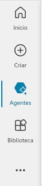

Clique na opção de criar novo agente:

Caso seu idioma esteja em Português, ou algum outro, coloque em Inglês (en-US):

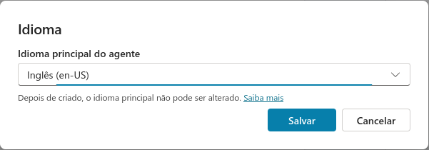

Após isso, é só configurar e apertar em **"Criar"**:

1. **Nome:** Coloque o nome do seu agente;
2. **Descrição:** Adicione uma descrição detalhada informando oque seu agente irá fazer;
3. **Instruções:** Parte que ficará seus prompt's (recomendado fazer engenharia de prompt);
4. **Prompts iniciais:** Você irá colocar exemplos de prompts que são aceitos no seu agente;
5. **Conhecimento:** Aqui você adiciona sua base de conhecimentos, caso tenha.

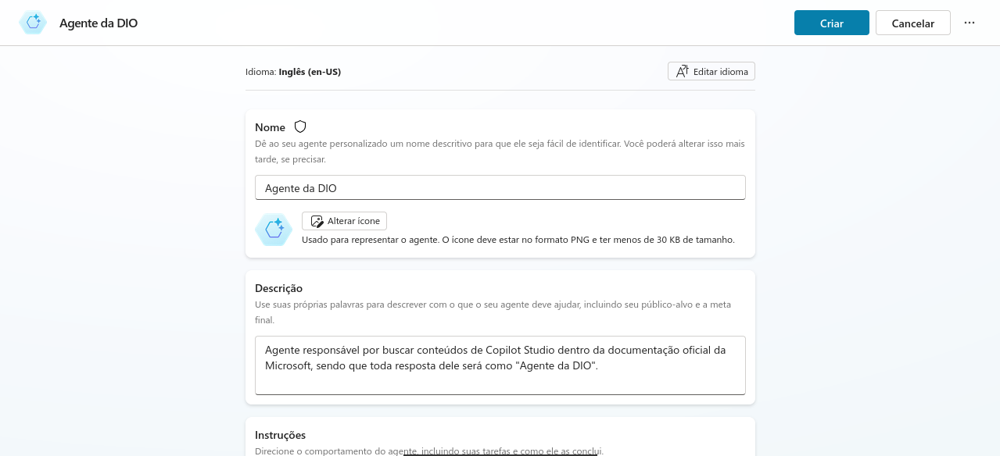

## Customizar um tópico

Para fazer a customização, vamos até a seção de tópicos:

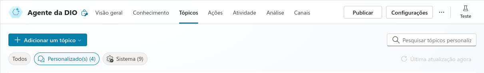

Clicamos na parte de **"Adicionar um tópico"** e adicionamos um tópico em branco:

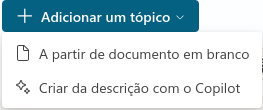

E nele, podemos adicionar as frases de gatilho:

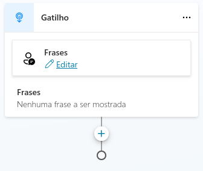

E configurar os tópicos personalizados do nosso agente.

## Personalizar uma mensagem de erro de tópico

- **Opção 1:** Conversation boosting

    A primeira opção que temos para personalizar uma mensagem de erro, dentro da seção de tópicos, será configurando o **Conversational boosting** que está nos tópicos do sistema:

    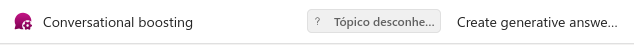

    ***Observação:*** Esse é o melhor cenário, quando estamos utilizando IA ou respostas generativas dentro do Copilot Studio.

    <h4 align="center">Exemplo de mensagem personalizada</h4>

    

- **Opção 2:** Fallback

    A segunda opção, é utilizar o **Fallback**:

    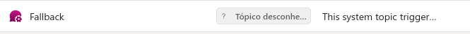

    Pois, todas as falhas, que acontecerem, irá cair no **Fallback**.

## Aumentar/diminuir a qualidade da resposta com GenAI

Podemos configurar para que o nosso Copilot busque respostas através de IA's ou em bases de conhecimentos:

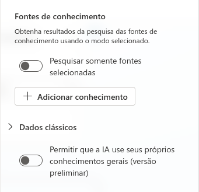

- **Fontes de conhecimento:** Se essa opção estiver habilitada, o Copilot irá buscar as respostas através das bases de conhecimentos fornecidas;

- **Dados clássicos:** Já nessa outra opção, o Copilot irá permitir que a IA responda as perguntas com base nos conhecimentos gerais.

Além disso, também podemos customizar o nosso prompt com variáveis na seguinte seção:

<h4 align="center">Exemplo de customização de prompt</h4>

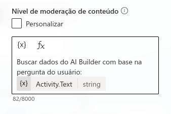

Se a opção **Personalizar**, que está acima da caixa de texto, estiver marcada. Podemos customizar o nível de pesquisa da IA:

- **Alto(a):** Busca ser menos criativo(a) possível, porém mais conciso(a);

- **Médio(a):** Busca o meio termo entre as duas opções;

- **Baixo(a):** Busca ser mais criativa(o) possível, independente da pergunta.

Além desse modo de configuração, podemos modificar a parte da qualidade da IA Generativa, indo nas **Configurações**, no canto superior direito:

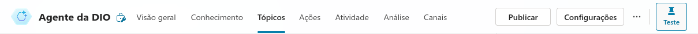

Indo na aba de **IA Generativa**, e por fim, escolhendo o modo de interação com as pessoas e o nível da moderação de conteúdo:

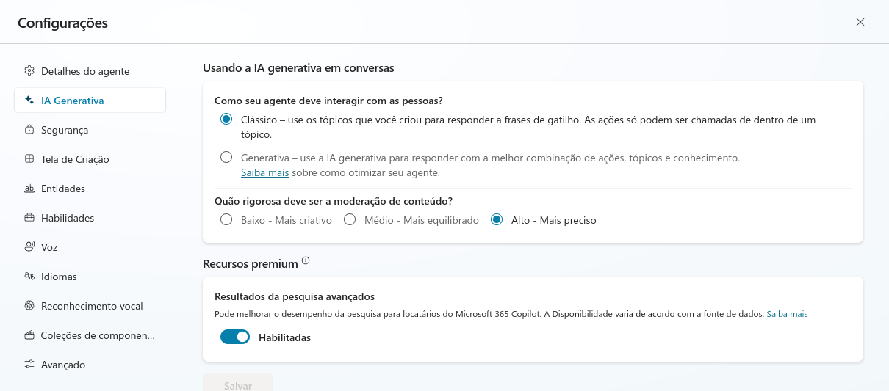

## Conclusão

Com este guia, você tem uma visão geral de como criar, personalizar e configurar um Copilot com fluxo de conversa no Microsoft Copilot Studio. Desde a criação de agentes em branco até a customização de tópicos, mensagens de erro e ajustes na qualidade das respostas geradas pela IA, todas as etapas foram detalhadas para facilitar o desenvolvimento de um agente eficiente e alinhado às suas necessidades.