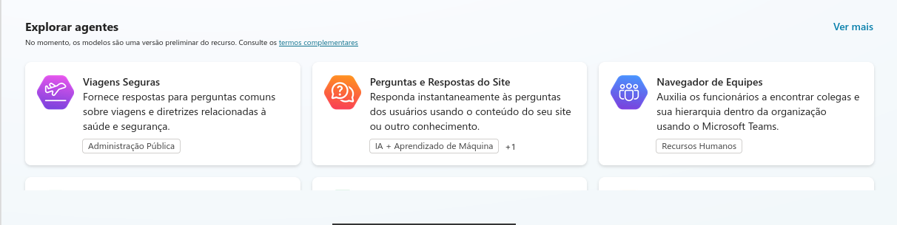
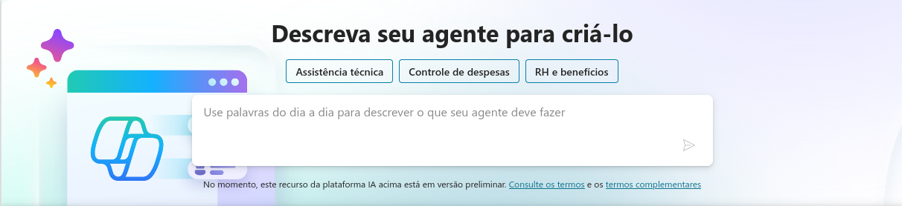
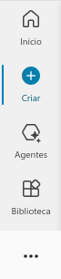
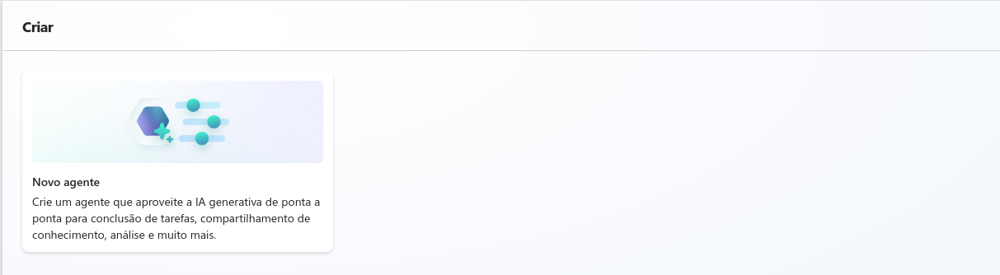

# Primeiro Copilot - Microsoft Copilot Studio

Este repositório está destinado ao desafio da **Suzano - Python Developer**, bootcamp da **DIO**, onde o objetivo é criar um resumo sobre a criação do primeiro copilot através do Microsoft Copilot Studio.

---

## Passos para criar seu primeiro Copilot

### 1. Conectar/Criar uma conta no Microsoft 365:

Acesse o [Copilot Studio](https://copilotstudio.microsoft.com/) e conecte com, ou crie, sua conta do Microsoft 365.

### 2. Maneiras de como criar seu primeiro Copilot:

Agora, vou apresentar 3 maneiras de como você pode criar o seu primeiro Copilot, após entrar no site.

1. **Criar um Copilot baseado em modelo:**

    Na página inicial, irá aparecer **Explorar agentes**, nesse local estará alguns modelos de Copilot's disponíveis para serem criados:

    

    ***Observação:*** Ao clicar em **Ver mais**, mostrará todos os copilot's disponíveis, ou em desenvolvimento, dependendo da sua região.

    Com isso, basta apenas escolher um que se adeque ao seu sistema e configurá-lo.

2. **Criar um Copilot baseado em descrição com IA:**

    Na página inicial, no canto superior, terá um campo com **"Descreva seu agente para criá-lo"** e logo abaixo uma caixa de texto:

    

    Para criar o seu modelo através de uma descrição com IA, basta apenas colocar um prompt informando o que seu Copilot deverá fazer:

    **Exemplo:**

    *"Criar um agente de viagens para a empresa DIO que vai ser responsável por listar todos os requisitos para viajar ao exterior partindo do Brasil. Esse agente vai consultar informações de uma base de dados do Excel."*

    ***Observação:*** Utilize boas práticas de prompt's para criar o seu Copilot e dê preferência a um prompt em inglês.

3. **Criar um Copilot em branco:**
    
    Para criar um agente em branco, navegue para a página de criar agentes:

    

    E clique na primeira opção:

    

    Por fim, configure o seu Copilot, de acordo com o que você deseja que ele execute na sua aplicação.

## Conclusão

Dessa forma, podemos criar diferentes Copilots com a ajuda do Microsoft Copilot Studio, seja utilizando modelos prontos, descrições com IA ou começando do zero. Cada método oferece flexibilidade e personalização para atender às necessidades específicas de sua aplicação.

Com essas ferramentas, você pode facilmente integrar e configurar Copilots que aprimoram a eficiência e a funcionalidade de seus projetos.